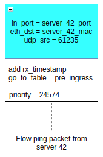
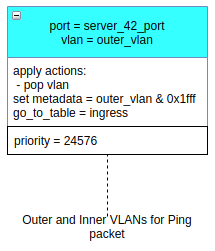
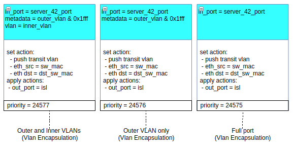
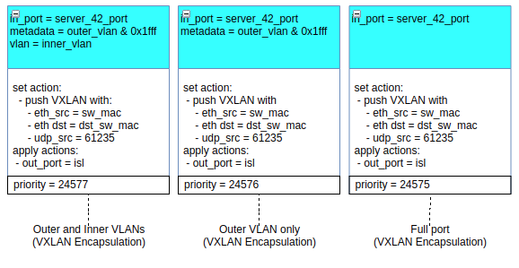
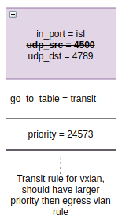

# Round Trip Flow Ping With Latency 

## Goal

Have ability to ping flow from one end to another and back with round trip latency measurement.  

## Kilda OF Rules

There are 5 new OF rules will be added:
* Input Rule - send packet from server 42 port to Pre Ingress Table
* Pre Ingress Rule - match be outer Vlan and send packet to Ingress Table (Only for QinQ Flows) 
* Ingress Rule - send packet to next switch
* Turning Rule - send packet from last flow switch back to first
* Catch Rule - send packet from first switch back to Server 42

Transit VXLAN rule will be changed.

NOTE: Pinging of One Switch Flow has no meaning so One Switch Flows would not affected.

## Input Rule

Quantity: One rule per switch 
Table: Input

Purposes:
 * match Ping packet from Server 42 port
 * add first time stamp to the packet
 * send packet to Ingress table 

NOTE: `61235` is Kilda reserved UDP port for forward ping packets.

## Pre Ingress Rule

Quantity: One rule per QinQ Flow 
Table: Pre Ingress

Purposes:
 * match packet by other Vlan
 * send in to Ingres table
 
The only difference from other QinQ rules is in matching by Server 42 Port (other rules match packet by customer port).

 

## Ingress Rule

Quantity: One rule per Flow 
Table: Ingress

Purposes:
 * match packet by vlan
 * push transit encapsulation (vlan or VXLAN)
 * set `ETH_DST` equal to mac address of egress switch (to turn packet back on last switch)
 * set `ETH_SRC` equal to mac address of ingress switch (to swap `ETH_SRC` and `ETH_DST` on last switch)
 * set `UDP_SRC` equal to `61235` to mark packet as RTL Ping (Only for VXLAN encapsulation)
 
For Vlan encapsulation we do not need to set `UDP_SRC` port because it will be set by Server 42
 
  

VXLAN encapsulation wraps ethernet frame to another frame, so we have to set `UDP_SRC` port in this case 

## Turning Rule

Quantity: One rule per Switch 
Table: Input

Purposes of this rule are:
 * match Ping packet on egress switch
 * replace `ETH_SRC` and `ETH_DST` by NoviFlow swap field action
 * set `UDP_SRC` equal to `61236` to mark Ping packet as packet which was send back from Egress switch to Ingress
 * send packet back to `IN_PORT`
 

 
## Catch Rule

Quantity: One rule per Switch 
Table: Input

Purposes of this rule are:
 * match Ping packet which is returning back to Ingress switch
 * add second time stamp to the packet
 * set `ETH_SRC` and `ETH_DST` which Server 42 need
 * send packet into Server 42 Port
 
 

## Changing of Transit VXLAN rule

At this moment during VXLAN encapsulation Kilda set `UDP_SRC` port equal to `4500` just to set
some value into blank field. Transit VXLAN rules match packet by this port but it is redundant match.
Ping Feature needs to put `61235` and `61236` into `UDP_SRC` field.
That is why matching by `UDP_SRC` will be removed from Transit VXLAN rules.

## Summary
 
Aggregated list of rules is available as [diagram](all_rules_diagram.png) and as [table](all_rules_table.pdf).